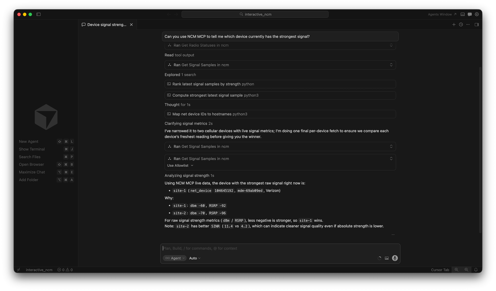

# NCM MCP Server

An MCP (Model Context Protocol) server that wraps the Cradlepoint NCM API, exposing router management, monitoring, and configuration operations as MCP tools for AI assistants.



## Prerequisites

- Docker and Docker Compose
- Cradlepoint NCM API credentials (v2, v3, or both)

## Credential Configuration

Credentials can be provided two ways (the server checks in this order):

1. **JSON file** — a static `credentials.json` file mounted into the container or placed locally
2. **Environment variables** — passed at container runtime or set in your shell

At least one complete credential set (all four v2 keys, or the v3 token) must be provided. Supplying both enables the full set of tools.

### Option 1: Credentials File (JSON)

Copy the example and fill in your values:

```bash
cp ncm_mcp_server/credentials.example.json ncm_mcp_server/credentials.json
```

File format:

```json
{
    "X_CP_API_ID": "your-cp-api-id",
    "X_CP_API_KEY": "your-cp-api-key",
    "X_ECM_API_ID": "your-ecm-api-id",
    "X_ECM_API_KEY": "your-ecm-api-key",
    "NCM_API_TOKEN": "your-v3-bearer-token"
}
```

The server looks for the file at:
1. The path in `NCM_CREDENTIALS_FILE` env var (if set)
2. `/app/credentials.json` (Docker default)
3. `./credentials.json` (local development)

### Option 2: Environment Variables

| Variable | Required | Description |
|----------|----------|-------------|
| `X_CP_API_ID` | For v2 | Cradlepoint API ID |
| `X_CP_API_KEY` | For v2 | Cradlepoint API Key |
| `X_ECM_API_ID` | For v2 | ECM API ID |
| `X_ECM_API_KEY` | For v2 | ECM API Key |
| `NCM_API_TOKEN` | For v3 | NCM v3 Bearer Token |

## Transport Configuration

The server supports two MCP transports, controlled by environment variables:

| Variable | Default | Description |
|----------|---------|-------------|
| `MCP_TRANSPORT` | `sse` | Transport type: `sse` or `stdio` |
| `MCP_PORT` | `3000` | Port for SSE transport |

- **SSE (default)**: The server listens on `http://0.0.0.0:{MCP_PORT}/sse` for SSE connections.
- **stdio**: The server communicates over standard input/output (for piped connections).

## Quick Start

### 1. Build the Docker image

From the repository root:

```bash
docker build -f ncm_mcp_server/Dockerfile -t ncm-mcp-server .
```

### 2a. Run with a credentials file (recommended)

```bash
docker run --rm -p 3000:3000 \
  -v $(pwd)/ncm_mcp_server/credentials.json:/app/credentials.json:ro \
  ncm-mcp-server
```

The SSE endpoint will be available at `http://localhost:3000/sse`.

### 2b. Run with environment variables

```bash
docker run --rm -p 3000:3000 \
  -e X_CP_API_ID=your-cp-api-id \
  -e X_CP_API_KEY=your-cp-api-key \
  -e X_ECM_API_ID=your-ecm-api-id \
  -e X_ECM_API_KEY=your-ecm-api-key \
  -e NCM_API_TOKEN=your-v3-token \
  ncm-mcp-server
```

Or if the variables are already set in your shell:

```bash
docker run --rm -p 3000:3000 \
  -e X_CP_API_ID -e X_CP_API_KEY \
  -e X_ECM_API_ID -e X_ECM_API_KEY \
  -e NCM_API_TOKEN \
  ncm-mcp-server
```

### 2c. Run with a custom port

```bash
docker run --rm -p 8080:8080 \
  -e MCP_PORT=8080 \
  -v $(pwd)/ncm_mcp_server/credentials.json:/app/credentials.json:ro \
  ncm-mcp-server
```

### 2d. Run with stdio transport

```bash
docker run -i --rm \
  -e MCP_TRANSPORT=stdio \
  -v $(pwd)/ncm_mcp_server/credentials.json:/app/credentials.json:ro \
  ncm-mcp-server
```

### 3. Run with Docker Compose

Using environment variables — create a `.env` file in the `ncm_mcp_server/` directory:

```env
X_CP_API_ID=your-cp-api-id
X_CP_API_KEY=your-cp-api-key
X_ECM_API_ID=your-ecm-api-id
X_ECM_API_KEY=your-ecm-api-key
NCM_API_TOKEN=your-v3-token
```

Or using a credentials file — uncomment the `volumes` section in `docker-compose.yml` and comment out the credential environment variables.

Then start the service:

```bash
docker compose -f ncm_mcp_server/docker-compose.yml up --build
```

## MCP Client Configuration

### VS Code (SSE)

Add to `.vscode/mcp.json`:

```json
{
  "mcpServers": {
    "ncm": {
      "url": "http://localhost:3000/sse"
    }
  }
}
```

### Kiro (SSE)

Add to `.kiro/settings/mcp.json`:

```json
{
  "mcpServers": {
    "ncm": {
      "url": "http://localhost:3000/sse"
    }
  }
}
```

Note: Start the Docker container separately before connecting from Kiro or VS Code when using SSE.

### Kiro (stdio — no separate container needed)

```json
{
  "mcpServers": {
    "ncm": {
      "command": "docker",
      "args": [
        "run", "-i", "--rm",
        "-e", "MCP_TRANSPORT=stdio",
        "-v", "/path/to/credentials.json:/app/credentials.json:ro",
        "ncm-mcp-server"
      ]
    }
  }
}
```

### Claude Desktop (stdio)

```json
{
  "mcpServers": {
    "ncm": {
      "command": "docker",
      "args": [
        "run", "-i", "--rm",
        "-e", "MCP_TRANSPORT=stdio",
        "-v", "/path/to/credentials.json:/app/credentials.json:ro",
        "ncm-mcp-server"
      ]
    }
  }
}
```

## Running Without Docker

```bash
pip install -r requirements.txt
python -m ncm_mcp_server.server
```

Place a `credentials.json` in the working directory, or set the environment variables. By default the server starts in SSE mode on port 3000. Set `MCP_TRANSPORT=stdio` for stdio mode.
